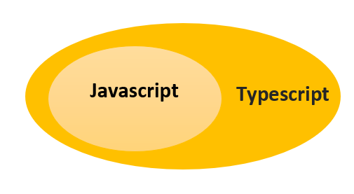

# Typescript

<details><summary><b>Introduction</b></summary>
<p>

JavaScript was introduced as a language for the client side. The development of Node.js has marked JavaScript as an emerging server-side technology too. However, as JavaScript code grows, it tends to get messier, making it difficult to maintain and reuse the code. Moreover, its failure to embrace the features of Object Orientation, strong type checking and compile-time error checks prevents JavaScript from succeeding at the enterprise level as a full-fledged server-side technology. TypeScript was presented to bridge this gap.

Typescript is a superset of Javascript




A TypeScript program contains:

* Modules
* Functions
* Variables
* Statements and Expressions
* Comments
</p>
</details>


<details><b><summary>Hello World! in Typescript</summary></b>
<p>

```
const msg:string = "Hello World!" 
console.log(msg)
```
</p>
</details>


<details><summary>Keywords in Typescript</summary>
<p>

| break | as | any | switch | case | if | throw |
| :---: | :---: | :---: | :---: | :---: | :---: | :---: |
| else | var | number | string | get | module | type |
| instanceof | typeof | public | private | enum | export | finally |
| for | while | void | null | super | this | new |
| in | return | true | false | any | extends | static | 
| let | package | implements | interface | function | new | try |
| yield | const | continue | do | catch |

</p>
</details>


<details><summary>Types in Typescript</summary>
<p>
</p>
</details>


<details><summary>Variables and Constants</summary>
<p>
</p>
</details>


<details><summary>Operators</summary>
<p>
</p>
</details>


<details><summary>Conditional Statements</summary>
<p>
</p>
</details>


<details><summary>Loops</summary>
<p>
</p>
</details>


<details><summary>Functions</summary>
<p>
</p>
</details>


<details><summary>Arrays</summary>
<p>
</p>
</details>


<details><summary>Classes & Objects</summary>
<p>
</p>
</details>


<details><summary>Modules</summary>
<p>
</p>
</details>

